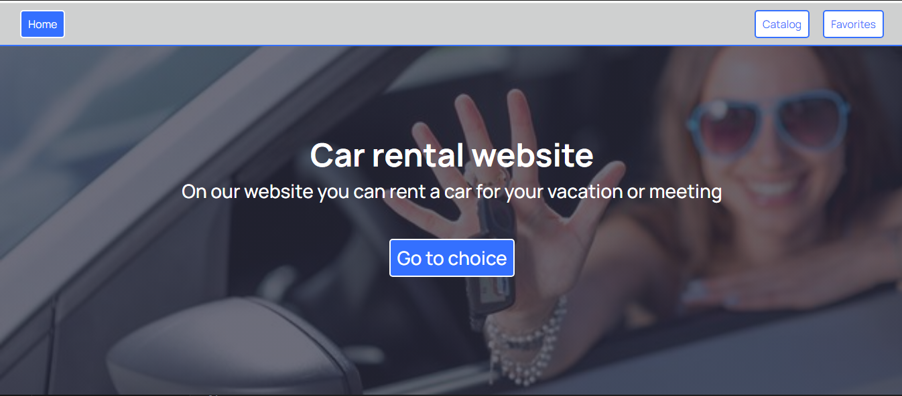

**Link to** [BACKEND](https://andrey291188.github.io/job-test/)

# CAR RENTAL

## About the project:

CAR RENTAL: With us you can rent a good car at an affordable price!

The Car Rental website is a specialized application designed to streamline and enhance the car rental process. This application is crafted to effortlessly monitor your car rental activities and establish personalized goals to optimize your rental experience. The user-friendly and responsive interface simplifies the management of your car rental needs without unnecessary complexity.

This project is implemented using TypeScript, leveraging the React JS library for the frontend and Mockapi for the backend. The combination of these technologies ensures efficient and reliable development, creating a seamless experience for users managing their car rental activities.

Improve your car rental habits – download the Car Rental website now and simplify the way you rent cars!

## Technologies used in the project

**Front-end** 
`TypeScript` `React` `ReduxToolkit` `ReduxPersist` `Axios` `HTML/CSS` `Formik`

## The developer who worked on the project:

**Andrii Zaiats** - Full-stack developer.
